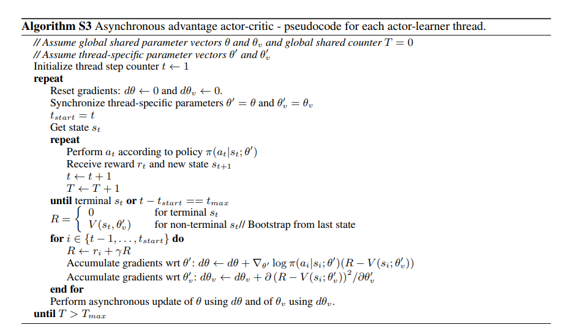
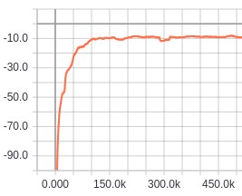

# A3C

TensorFlow implementation of [Asynchronous Methods for Deep Reinforcement Learning](https://arxiv.org/pdf/1602.01783.pdf). (2016. 2)



## Requirements

- Python 3
- TensorFlow 1.5
- gym
- MuJoCo (30-day trial)


## Project Structure


    ├── config                  # Config files (.yml)
    ├── actor.py                # actor network, loss
    ├── critic.py               # critic network, loss
    ├── agent.py                # agent 
    ├── main.py                 # train and eval
    ├── utils.py                # config, save tools  
    └── hooks.py                # train and eval hooks
    

## Config

a3c.yml

```yml
data:
  base_path: 'data/'
  save_state_file: 'state.pkl'
  env_name: 'Reacher-v2'

train:
  max_episode_steps: 200

  reward_decay: 0.9

  entropy_beta: 0.01

  update_n_iter: 5

  actor_lr: 0.0001
  critic_lr: 0.001

  save_checkpoints_steps: 100000
  model_dir: 'logs/a3c'
  max_steps: 400000
```


## Run


Train

```
python main.py --mode train
```

Evaluate
```
python main.py --mode eval
```

## Tensorboard
Average reward of 100 episode




## Example
Teach the robot arm to reach randomly located ball


