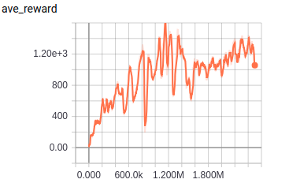

# DDPG

TensorFlow implementation of [Continuous control with deep reinforcement learning](https://arxiv.org/pdf/1509.02971.pdf). (2015. 9)


## Requirements

- Python 3
- TensorFlow 1.5
- gym
- MuJoCo (30-day trial)


## Project Structure


    ├── config                  # Config files (.yml)
    ├── actor.py                # actor network, loss
    ├── critic.py               # critic network, loss
    ├── agent.py                # agent 
    ├── main.py                 # train and eval
    ├── utils.py                # config, save tools  
    └── hooks.py                # train and eval hooks
    

## Config

DDPG.yml

```yml
data:
  base_path: 'data/'
  save_state_file: 'state.pkl'
  env_name: 'Hopper-v2'

train:
  batch_size: 64

  noise_theta: 0.15
  noise_sigma: 0.2
  noise_mu: 0.0

  reward_decay: 0.99
  observe_n_iter: 100000
  memory_size: 1000000

  TAU: 0.001

  critic_l2_loss_weight: 0.02

  actor_lr: 0.0001
  critic_lr: 0.001

  save_checkpoints_steps: 200000
  model_dir: 'logs/ddpg'
  max_steps: 2500000
```


## Run


Train

```
python main.py --mode train
```

Evaluate

```
python main.py --mode eval
```

## Tensorboard
Average reward of 100 episode




## Example
Teach the object to jump
  


