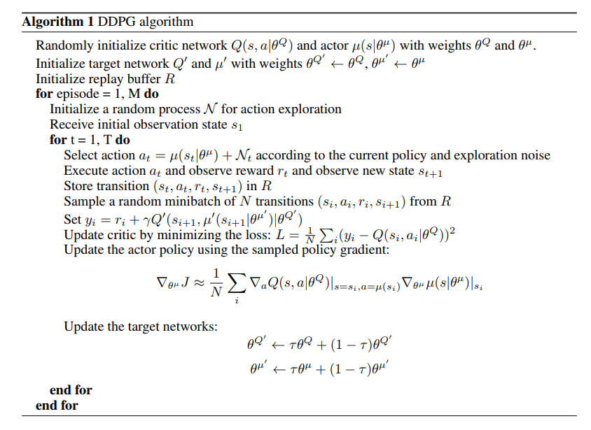

# DDPG

TensorFlow implementation of [Continuous control with deep reinforcement learning](https://arxiv.org/pdf/1509.02971.pdf). (2015. 9)



## Requirements

- Python 3
- TensorFlow 1.5
- gym


## Project Structure


    ├── config                  # Config files (.yml)
    ├── architecture            # architecture graphs
        ├── __init__.py             # network
    ├── agent.py                # define agent, model, loss
    ├── main.py                 # train and evaluate
    ├── utils.py                # config tools 
    ├── replay_memory.py        # restore and sample 
    └── train_hooks.py          # define algo hook
    

## Config

DDPG.yml

```yml
data:
  base_path: 'data/'
  save_state_file: 'state.pkl'
  action_dim: 1
  state_dim: 3

train:
  batch_size: 32

  reward_decay: 0.9
  observe_n_iter: 10000
  memory_size: 10000

  TAU: 0.01

  actor_learning_rate: 0.001
  critic_learning_rate: 0.001

  save_checkpoints_steps: 5000
  model_dir: 'logs/ddpg'
  max_steps: 30000

```


## Run


Train

```
python main.py
```

