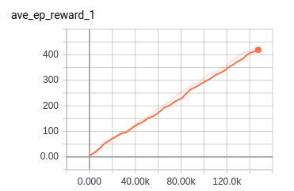
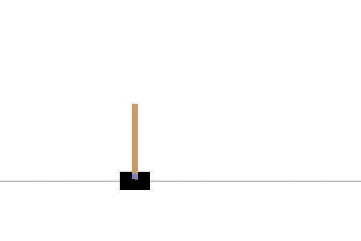

# DQN

TensorFlow implementation of [Human-level control through deep reinforcement
learning](https://web.stanford.edu/class/psych209/Readings/MnihEtAlHassibis15NatureControlDeepRL.pdf). (2015. 2)


## Requirements

- Python 3
- TensorFlow 1.5
- gym


## Project Structure


    ├── config                  # Config files (.yml)
    ├── model.py                # network, loss
    ├── agent.py                # agent 
    ├── main.py                 # train and eval
    ├── utils.py                # config, save tools
    ├── replay_memory.py        # restore and sample 
    └── hooks.py                # train and eval hooks
    

## Config

DQN.yml

```yml
data:
  base_path: 'data/'
  save_state_file: 'state.pkl'
  env_name: 'CartPole-v1'

train:
  batch_size: 32

  initial_epsilon: 1.0
  epsilon_decrement: 0.001
  final_epsilon: 0.1

  reward_decay: 0.9
  observe_n_iter: 1500
  memory_size: 3000
  replace_target_n_iter: 100

  learning_rate: 0.01
  save_checkpoints_steps: 10000
  model_dir: 'logs/DQN'
  max_steps: 150000
```


## Run


Train

```
python main.py --mode train
```

Evaluate

```
python main.py --mode eval
```

## Tensorboard
Average reward of 100 episode



## Example
Balance a pole on a cart


