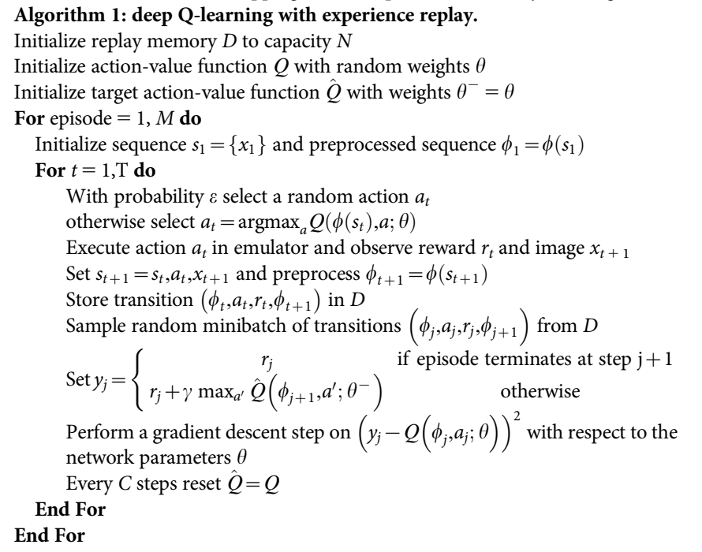

# DQN

TensorFlow implementation of [Human-level control through deep reinforcement
learning](https://web.stanford.edu/class/psych209/Readings/MnihEtAlHassibis15NatureControlDeepRL.pdf). (2015. 2)



## Requirements

- Python 3
- TensorFlow 1.5
- gym


## Project Structure


    ├── config                  # Config files (.yml)
    ├── architecture            # architecture graphs
        ├── __init__.py             # network
    ├── agent.py                # define agent, model, loss
    ├── main.py                 # train and evaluate
    ├── utils.py                # config tools 
    ├── replay_memory.py        # restore and sample 
    └── hooks.py                # define hooks
    

## Config

DQN.yml

```yml
data:
data:
  base_path: 'data/'
  save_state_file: 'state.pkl'
  env_name: 'MountainCar-v0'

train:
  batch_size: 32

  initial_epsilon: 0.1

  reward_decay: 0.9
  observe_n_iter: 1500
  memory_size: 3000
  replace_target_n_iter: 200

  learning_rate: 0.005
  save_checkpoints_steps: 5000
  model_dir: 'logs/DQN'
  max_steps: 20000

```


## Run


Train

```
python main.py
```


## Example


