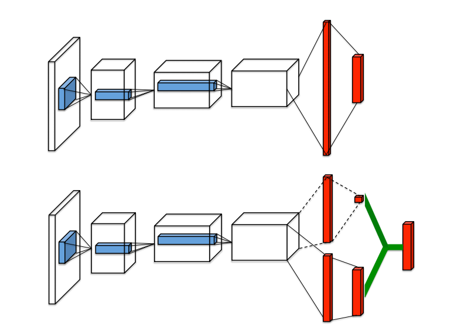
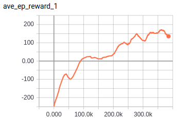
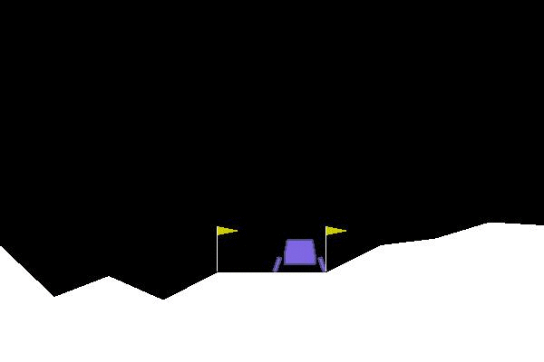

# Dueling DQN

TensorFlow implementation of [Dueling Network Architectures for Deep Reinforcement Learning](https://arxiv.org/pdf/1511.06581.pdf). (2015. 11)



## Requirements

- Python 3
- TensorFlow 1.5
- gym


## Project Structure


    ├── config                  # Config files (.yml)
    ├── model.py                # network, loss
    ├── agent.py                # agent 
    ├── main.py                 # train and eval
    ├── utils.py                # config, save tools
    ├── replay_memory.py        # restore and sample 
    └── hooks.py                # train and eval hooks
    

## Config

dueling-DQN.yml

```yml
data:
  base_path: 'data/'
  save_state_file: 'state.pkl'
  env_name: 'LunarLander-v2'

train:
  batch_size: 32
  max_episode_steps: 400

  initial_epsilon: 1.0
  epsilon_decrement: 0.0001
  final_epsilon: 0.01

  reward_decay: 0.99
  observe_n_iter: 100000
  memory_size: 100000
  replace_target_n_iter: 1000

  learning_rate: 0.001
  save_checkpoints_steps: 100000
  model_dir: 'logs/dueling-DQN'
  max_steps: 400000
```


## Run


Train

```
python main.py --mode train
```

Evaluate

```
python main.py --mode eval
```

## Tensorboard
Average reward of 100 episode




## Example
Navigator a lander to its landing pad


