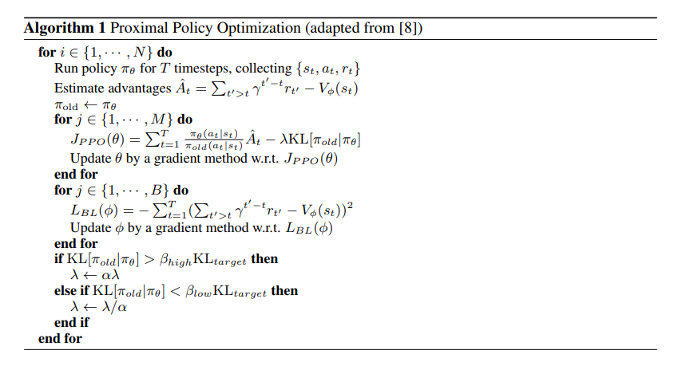
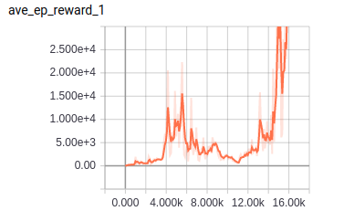

# PPO

TensorFlow implementation of [Proximal Policy Optimization Algorithms](https://arxiv.org/pdf/1707.06347.pdf). (2017. 7),  
and [Emergence of Locomotion Behaviours in Rich Environments](https://arxiv.org/pdf/1707.02286.pdf). (2017. 7)



## Requirements

- Python 3
- TensorFlow 1.5
- gym
- MuJoCo (30-day trial)


## Project Structure


    ├── config                  # Config files (.yml)
    ├── actor.py                # actor network, loss
    ├── critic.py               # critic network, loss
    ├── agent.py                # agent 
    ├── main.py                 # train and eval
    ├── utils.py                # config, save tools  
    └── hooks.py                # train and eval hooks
    

## Config

ppo.yml

```yml
data:
  base_path: 'data/'
  save_state_file: 'state.pkl'
  env_name: 'Walker2d-v2'

train:
  reward_decay: 0.99

  surrogate_clip: True
  actor_update_steps: 10

  kl_loss_lam: 0.5
  kl_loss_eta: 50

  actor_train_episode: 10
  critic_train_episode: 10

  kl_lam_alpha: 2.0


  clip_epsilon: 0.2
  kl_target: 0.003
  kl_target_beta: 1.5

  actor_lr: 0.0001
  critic_lr: 0.0002

  save_checkpoints_steps: 2000
  model_dir: 'logs/ppo'
  max_steps: 20000

```


## Run


Train

```
python main.py --mode train
```

Evaluate
```
python main.py --mode eval
```

## Tensorboard
Average reward of 100 episode




## Example
Teach the object to run with two legs


