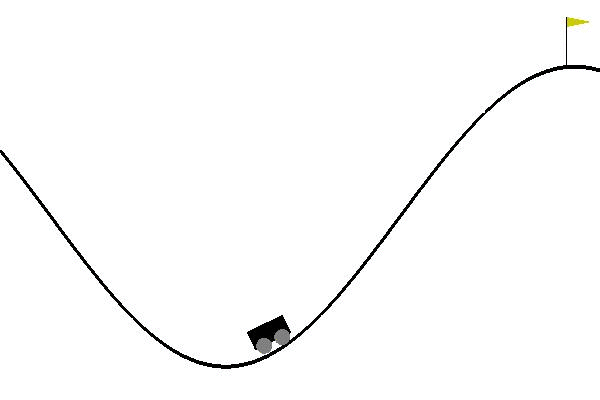
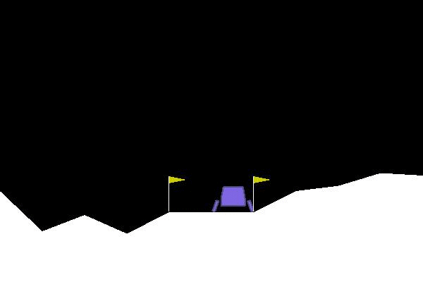

# Deep Reinforcement Learning Algorithm

TensorFlow implementation of deep reinforcement learning algorithm

**DQN**  

**Prioritized-DDQN**  

**Dueling-DQN**  

**Reinforce-Policy-Gradient**  

**A3C**  

**DDPG**  

**PPO**  

