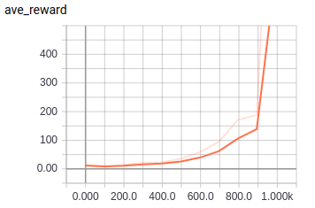
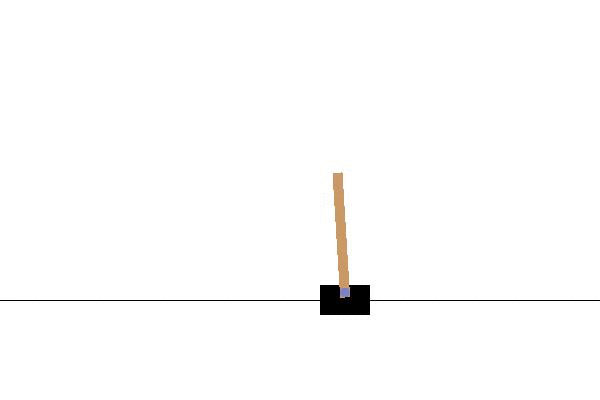

# Reinforce-PG

TensorFlow implementation of Reinforce Policy Gradient

## Requirements

- Python 3
- TensorFlow 1.5
- gym


## Project Structure


    ├── config                  # Config files (.yml)
    ├── model                   # network, loss
    ├── agent.py                # agent
    ├── main.py                 # train and evaluate
    ├── utils.py                # config, save tools 
    └── hooks.py                # train, eval hooks
    

## Config

reinforce.yml

```yml
data:
  base_path: 'data/'
  save_state_file: 'state.pkl'
  env_name: 'CartPole-v1'

train:
  reward_decay: 0.99

  learning_rate: 0.001
  save_checkpoints_steps: 100
  model_dir: 'logs/reinforce'
  max_steps: 1000
```


## Run


Train

```
python main.py --mode train
```

Evaluate

```
python main.py --mode eval
```

## Tensorboard
Average reward of 100 episode



## Example
Balance a pole on a cart

