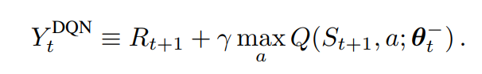
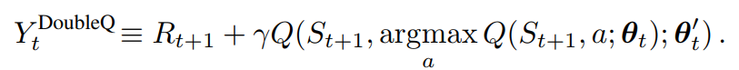

# double DQN

TensorFlow implementation of [Deep Reinforcement Learning with Double Q-learning](hhttps://arxiv.org/pdf/1509.06461.pdf). (2015. 9)




## Requirements

- Python 3
- TensorFlow 1.5
- gym


## Project Structure


    ├── config                  # Config files (.yml)
    ├── architecture            # architecture graphs
        ├── __init__.py             # network
    ├── agent.py                # agent
    ├── main.py                 # train and evaluate
    ├── utils.py                # config tools 
    ├── replay_memory.py        # restore and sample 
    └── model.py                # define model, loss, algo
    

## Config

double-DQN.yml

```yml
data:
  base_path: 'data/'
  save_state_file: 'state.pkl'
  num_action: 11
  state_dim: 3

train:
  batch_size: 32

  initial_epsilon: 0.1

  reward_decay: 0.9
  observe_n_iter: 1500
  memory_size: 3000
  replace_target_n_iter: 200

  learning_rate: 0.005
  save_checkpoints_steps: 5000
  model_dir: 'logs/double-DQN'
  max_steps: 20000

```


## Run


Train

```
python main.py
```


## Example


